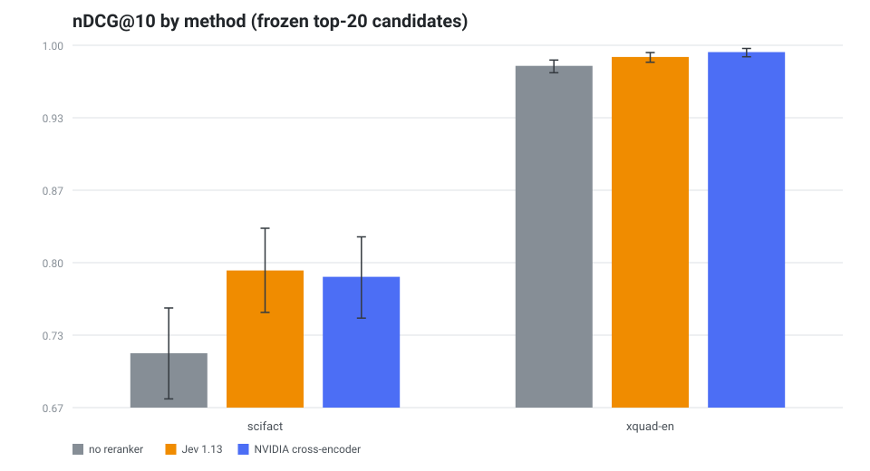
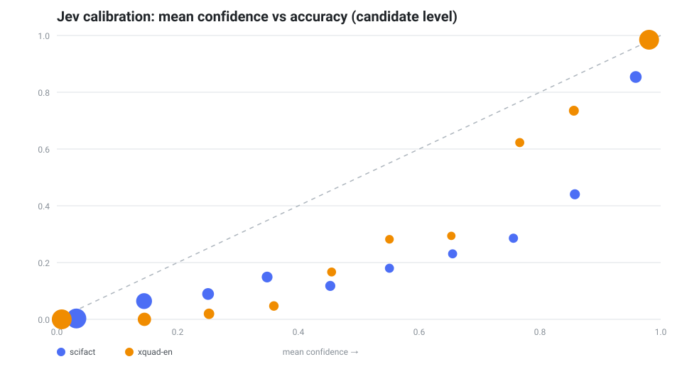
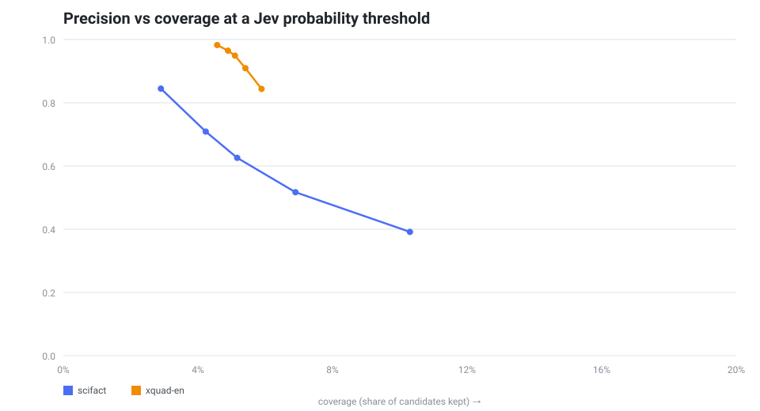
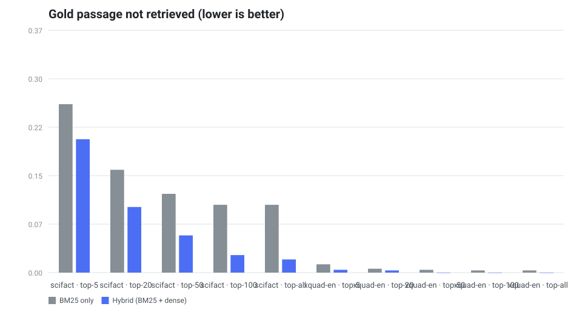
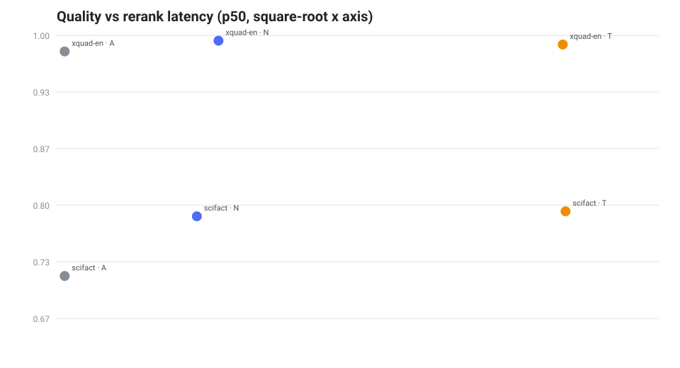
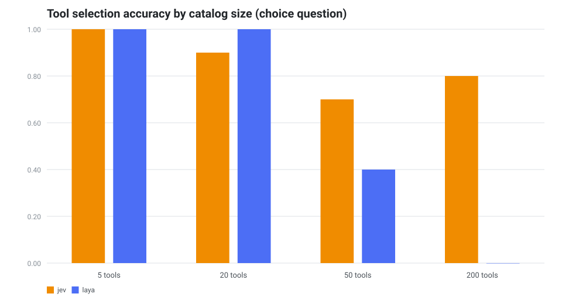
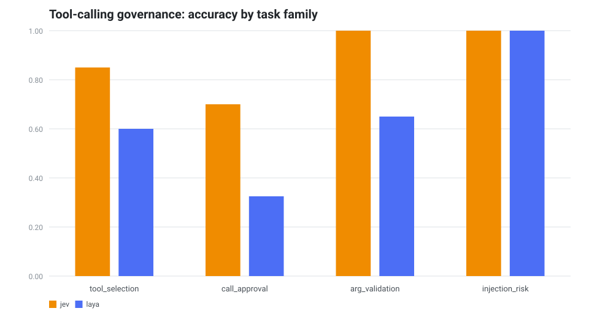

# Jev RAG Benchmark (English): Jev 1.13 vs NVIDIA cross-encoder vs no reranking

A free, reproducible, framework-neutral benchmark of **TypeSafe Jev 1.13 as the
reranking and decision layer of a RAG pipeline** — English data, frozen
candidate pools, paired bootstrap confidence intervals, and probability
calibration. Every published run used free tiers: **$0 total**.

It answers one question honestly: **does the model actually improve the system?**

[](LICENSE)


[](https://huggingface.co/spaces/emretheus/jev-rag-benchmark-leaderboard)
[](https://huggingface.co/datasets/emretheus/jev-rag-benchmark)

## Key findings (2026-09-21)

| Finding | Evidence |
|---|---|
| **Jev improves retrieval over the unranked baseline** | nDCG@10 **+0.82 pts** on XQuAD-EN (95% CI +0.35 to +1.31) and **+7.62 pts** on SciFact (CI +4.88 to +10.38) |
| **Against a dedicated cross-encoder** | Statistical tie on SciFact (+0.59 pts, CI −1.25 to +2.42); NVIDIA leads XQuAD by 0.45 pts |
| **Probabilities are well calibrated** | ECE **1.33%** (XQuAD) / 6.25% (SciFact); top-1 confidence 0.96 when correct vs 0.74 when wrong (XQuAD) |
| **Calibration enables high-precision filtering** | at p ≥ 0.7: **94.9% precision** at 5.1% coverage on XQuAD (19x the 5% base rate); SciFact 70.9% at p ≥ 0.8 (14x) |
| **Confidence-partitioned decisions beat baseline everywhere** | XQuAD **+0.89 pts** (CI +0.45 to +1.36); SciFact **+4.14 pts** (CI +2.13 to +6.29) while always-on is best there |
| **Answerability gating saves generation calls** | skipping generation below p = 0.9 drops 9.8% of calls and raises answer F1 from 30.6% to **31.3%** |
| **End-to-end answers from Jev top-5** | token F1 **30.6%**, exact match 1.3%, success (F1 ≥ 0.5) **17.3%**, abstention 2.6%, valid citations **99.85%** |
| **Cost** | **$0 actual** (free tiers); $0.33 at list price for all 1,490 reranked queries |

The decision-layer analyses (confidence partitioning, answerability gating) are
labeled **exploratory** in [`docs/protocol.md`](docs/protocol.md) — they were
added after the first ranking run and are reported with that label.

## Results

Auto-generated from real runs by `uv run jev-rag publish`. Never hand-edited;
fixture runs are refused. Charts for these tables live in
[`assets/benchmark/`](assets/benchmark).

<!-- RESULTS:START -->

_Generated 2026-09-23 09:28 UTC from real runs (scifact, xquad-en). Fixture runs are never published._
_Regenerate with:_ `uv run jev-rag publish`

### Reranking (frozen top-20 candidates, same pool for every method)

| Dataset | n | Method | nDCG@10 | Recall@5 | MRR@10 | Rerank p50 |
|---|---|---|---|---|---|---|
| scifact | 300 | A — no reranker (hybrid order) | 71.67% | 79.67% | 68.75% | 0 ms |
| scifact | 300 | T — TypeSafe Jev 1.13 batch noul | 79.29% | 85.67% | 77.03% | 4044 ms |
| scifact | 300 | N — NVIDIA cross-encoder reranker | 78.70% | 87.33% | 76.16% | 307 ms |
| xquad-en | 1190 | A — no reranker (hybrid order) | 98.11% | 99.58% | 97.60% | 0 ms |
| xquad-en | 1190 | T — TypeSafe Jev 1.13 batch noul | 98.93% | 99.66% | 98.67% | 4000 ms |
| xquad-en | 1190 | N — NVIDIA cross-encoder reranker | 99.37% | 99.66% | 99.27% | 409 ms |

### Probability calibration (candidate-level relevance)

| Dataset | Model | ECE (10 bin) | Brier | Top-1 accuracy | Top-1 confidence (correct) | Top-1 confidence (wrong) |
|---|---|---|---|---|---|---|
| scifact | TypeSafe Jev 1.13 batch noul | 0.0625 | 0.0366 | 71.00% | 0.812 | 0.549 |
| xquad-en | TypeSafe Jev 1.13 batch noul | 0.0133 | 0.0045 | 97.90% | 0.960 | 0.740 |

### RAG optimization mode (confidence-partitioned Jev, fixed t = 0.50)

| Dataset | Model | Threshold | A baseline nDCG@10 | Always-on nDCG@10 | Partitioned nDCG@10 | Delta vs baseline | 95% CI |
|---|---|---|---|---|---|---|---|
| scifact | TypeSafe Jev 1.13 batch noul | 0.50 | 71.67% | 79.29% | 75.81% | +4.14 pts | +2.13 to +6.29 |
| xquad-en | TypeSafe Jev 1.13 batch noul | 0.50 | 98.11% | 98.93% | 99.00% | +0.89 pts | +0.45 to +1.36 |

### Frozen-context answer generation

| Dataset | Generator | Token F1 | Exact match | F1 >= 0.5 | Abstention | Valid citations |
|---|---|---|---|---|---|---|
| xquad-en | T | diffusiongemma-26b | 30.58% | 1.26% | 17.31% | 2.61% | 99.85% |

### Cost at list price (actual published spend: $0, free tiers)

| Dataset | Branch | Input tokens | List price / 1M | Cost at list price |
|---|---|---|---|---|
| scifact | no reranker (hybrid order) | 0 | $0.000 | $0.0000 |
| scifact | NVIDIA cross-encoder reranker | 2,179,282 | $0.000 | $0.0000 |
| scifact | TypeSafe Jev 1.13 batch noul | 2,411,716 | $0.042 | $0.1013 |
| xquad-en | no reranker (hybrid order) | 0 | $0.000 | $0.0000 |
| xquad-en | NVIDIA cross-encoder reranker | 4,652,357 | $0.000 | $0.0000 |
| xquad-en | TypeSafe Jev 1.13 batch noul | 5,407,942 | $0.042 | $0.2271 |

_Metrics measure different stages: retrieval quality (nDCG, Recall) does not imply answer quality. See the per-run reports for confidence intervals, reliability bins, and risk-coverage tables._

<!-- RESULTS:END -->

### Charts











Share card for social posts: [`assets/social/jev-benchmark-card.png`](assets/social/jev-benchmark-card.png) ·
ready-to-post text: [`assets/social/linkedin-post.md`](assets/social/linkedin-post.md).

## Bonus: tool-calling governance (Jev vs Laya)

Decision models can also govern tool calls: which tool to use, whether a call
may run without review, whether arguments are valid, and whether observed text
tries to manipulate the assistant. All four families run on the same
deterministic synthetic cases (`jev-rag toolbench`), with **Laya served for free
through its official Hugging Face demo Space** and Jev through the Vercel AI
Gateway free tier.

| Task family (n = 40 each) | Jev 1.13 | Laya (open weights) |
|---|---|---|
| Tool selection, 5 tools | 100% | 100% |
| Tool selection, 20 tools | 90% | 100% |
| Tool selection, 50 tools | **70%** | 40% |
| Tool selection, 200 tools | **80%** | **0%** |
| Call approval (`noul`) | **70%** (Brier 0.198) | 32.5% (Brier 0.547) |
| Argument validation (`noul`) | **100%** (Brier 0.019) | 65% (Brier 0.238) |
| Injection detection (`noul`) | 100% (Brier 0.013) | 100% (Brier 0.014) |





What the table shows: the two models tie on small catalogs and injection
detection, but Jev holds up as the label space grows (80% at 200 options where
Laya reaches 0%) and its probabilities stay calibrated on the approval and
argument tasks. Laya's collapse beyond ~20 options matches its own model card's
documented head-budget limit. Fairness notes: cases are synthetic and
template-generated (n = 40 per family, one seed); Laya's latency here includes
the shared demo-Space queue and is not comparable to Jev's; Laya was served as
its English base checkpoint. Full artifacts: `reports/toolbench/`.

## Pipeline

```
queries ──► BM25 (top-100) ─┐
                            ├─► RRF fusion ─► frozen top-20 candidates
queries ──► NVIDIA embeddings┘                       │
                                                     ├─► A: hybrid order (baseline)
                                                     ├─► T: TypeSafe Jev 1.13 batch noul
                                                     └─► N: NVIDIA cross-encoder reranker
                                                     │
                            frozen top-5 of branch T ┴─► answer generation (free-tier model)
```

Every branch sees the **identical frozen candidate pool**. Reranking, branch
comparison, and generation are measured separately; generation replays over
frozen contexts so a fresh retrieval draw cannot contaminate it.

## Branches

| Branch | Method | Provider / cost |
|---|---|---|
| A | No reranker; hybrid RRF order is used as-is | local, $0 |
| T | TypeSafe `typesafe-ai/jev` (= Jev 1.13) batch **noul**: one request per query, one yes/no question per candidate | Vercel AI Gateway (free tier at run time) or OpenRouter |
| N | NVIDIA `llama-nemotron-rerank-vl-1b-v2` cross-encoder logits | NVIDIA NIM trial, $0 |

Adding a branch to existing results never re-runs the others:

```bash
uv run jev-rag add-branch --results results/xquad-en-a-n-t-real.jsonl --branch N --concurrency 4
```

## Quickstart (free stack)

```bash
uv sync --extra dev
cp .env.example .env     # keys: Vercel AI Gateway (Jev), NVIDIA NIM, Codiv (generator)

uv run jev-rag doctor
uv run jev-rag data prepare --dataset all
uv run jev-rag estimate --dataset xquad-en        # zero API calls

uv run jev-rag run --dataset xquad-en --branches A,T,N
uv run jev-rag generate --results results/xquad-en-a-n-t-real.jsonl --branch T
uv run jev-rag report --results results/xquad-en-a-n-t-real.jsonl \
  --generation results/xquad-en-a-n-t-real-gen-t-real.jsonl
uv run jev-rag charts --reports-dir reports/generated --output-dir assets/benchmark
uv run jev-rag publish --space-dir space
```

Offline pipeline check (no keys, no network, deterministic stand-ins):

```bash
uv run jev-rag run --dataset xquad-en --branches A,T,N --fixture --limit 25
```

Fixture runs are marked `run_kind=fixture` everywhere and are never published.

## Reproduce the published results

```bash
uv run jev-rag data prepare --dataset all
uv run jev-rag run --dataset xquad-en --branches A,T,N
uv run jev-rag run --dataset scifact --branches A,T,N
uv run jev-rag generate --results results/xquad-en-a-n-t-real.jsonl --branch T
uv run jev-rag report --results results/xquad-en-a-n-t-real.jsonl \
  --generation results/xquad-en-a-n-t-real-gen-t-real.jsonl
uv run jev-rag report --results results/scifact-a-n-t-real.jsonl
uv run jev-rag audit --dataset xquad-en
uv run jev-rag audit --dataset scifact
uv run jev-rag charts --reports-dir reports/generated --output-dir assets/benchmark
uv run jev-rag publish --space-dir space
```

## Metrics

- **Retrieval / reranking**: Recall@5, Recall@10, nDCG@10, MRR@10, candidate-pool
  ceiling, and a candidate-depth audit (BM25 vs hybrid) in `reports/audits/`.
- **Calibration** (candidate-level relevance probabilities): Brier score, ECE
  (10 bins), reliability table, risk-coverage, top-1 confidence split by
  correct/incorrect.
- **Decision layer**: confidence-partitioned reranking (fixed t = 0.50) and
  answerability gating (generation calls saved at each threshold).
- **Generation**: token F1, exact match, success rate (F1 ≥ 0.5), abstention
  rate, valid citation rate.
- **Cost/latency**: p50/p95 per stage, tokens per model, resolved model ids,
  actual cost when reported, list-price cost for budgeting.

Statistical comparison uses paired bootstrap CIs (5,000 resamples, seed 13).

## Reproducibility rules

- Datasets are downloaded at runtime and never committed (licenses below).
- The candidate pool is frozen before any reranker runs.
- Generation uses frozen contexts from exactly one branch.
- Model versions are pinned in config and resolved versions are recorded per row.
- Threshold analyses fix their threshold before evaluation; dev/test splits are
  used when a parameter is tuned.
- Safety caps exist for request counts and tokens per provider.
- Every run writes a manifest: config snapshot, dataset SHA-256, model ids,
  token totals, timestamps.

The preregistered protocol (research questions, hypotheses, decision rules,
changelog) is in [`docs/protocol.md`](docs/protocol.md).

## Differences from prior work

Compared with [`erendikmenn/jev-rag-benchmark`](https://github.com/erendikmenn/jev-rag-benchmark)
(the prior public Jev RAG benchmark; no code was copied):

| | Prior work | This repo |
|---|---|---|
| Language / data | Turkish XQuAD (1,044 q, 240 passages) | **English** XQuAD (1,190 q) + **SciFact** (300 claims / 5,183 abstracts) |
| Model tested | TypeSafe Jev 1.13 via OpenRouter (paid) | TypeSafe Jev 1.13 via **Vercel AI Gateway** (free tier at run time) |
| Baselines | Cohere Rerank 3.5 (paid) | **NVIDIA cross-encoder** (free) + no reranker |
| Calibration | Not measured | **Brier, ECE, reliability, risk-coverage, selective prediction** |
| Decision layer | Sample-based ablations | Confidence-partitioned reranking + answerability gating |
| Generation | Gemini vs DeepSeek on frozen Jev top-5 | Free-tier generator on frozen Jev top-5, with answerability gating |
| Cost | OpenRouter spend | **$0** for every published run |
| Framework | LlamaIndex app | Framework-neutral (3 runtime dependencies) |
| Sharing | Report + JSONL | Auto-updated README table, **charts suite**, HF static Space, `leaderboard.txt`, publish pipeline that refuses fixture data |

## Publishing

```bash
uv run jev-rag publish --space-dir space --repo-url https://github.com/emretheus/jev-rag-benchmark
uv sync --extra hf && export HF_TOKEN=hf_...
uv run jev-rag publish --push --repo-id emretheus/jev-rag-benchmark --repo-type dataset
uv run jev-rag publish --space-dir space \
  --push --repo-id emretheus/jev-rag-benchmark-leaderboard --repo-type space
```

Mint a DOI for the release with Zenodo (free) and cite it here.

## Data licenses

- XQuAD (English): CC BY-SA 4.0.
- SciFact / BEIR: abstracts ODC-By 1.0, annotations CC BY 4.0.

Raw data is downloaded by `jev-rag data prepare` and is git-ignored.

## Limitations

- **Exploratory analyses**: the gated mode and answerability gating were added
  after the first ranking run; they are labeled exploratory until replicated
  with a fresh candidate draw or another dataset.
- Jev's always-on reranking helps most where the first stage leaves headroom:
  on XQuAD the baseline is already at 98.1% nDCG, so the absolute gain is small.
- Branch T latency reflects Vercel AI Gateway free-tier pacing (~1 request/s),
  not standalone model latency (single-request pilot: ~0.6 s).
- XQuAD references are short extractive answers; token F1 is a proxy, not human
  factuality adjudication.
- The generator is a free-tier model (DiffusionGemma 26B via Codiv); generation
  consumes frozen contexts, so retrieval metrics are unaffected by it.
- Results describe the exact resolved model versions in each manifest. This
  benchmark is independent and not affiliated with TypeSafe AI. Baseline model
  availability changes over time (several NVIDIA models were retired on
  2026-08-25/26).

## Citation

See [`CITATION.cff`](CITATION.cff). If you use this benchmark, cite the
repository and the archived DOI release once minted.

## Development

```bash
uv sync --extra dev
uv run ruff check .
uv run pytest
```
